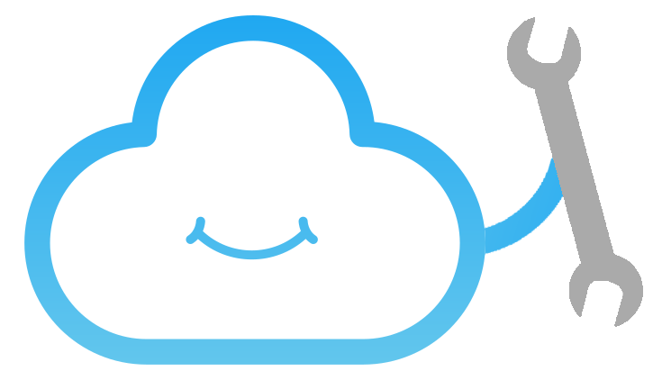

# Introduction

<aside class="notice">
Do not hesitate to <a href="https://github.com/cozy-labs/cozy-dev-docs/tree/master/source/index.md" target="_blank">edit this page</a> if you want to improve it.
</aside>

Welcome to the **Cozy Developer Space**.

<p style="text-align: center"></p>

Here you’ll find everything you need to understand Cozy technically and to develop applications and konnectors.

The **technical level required** to read and understand this documentation is not over 9,000: You’ll have to know how the Web works, from server-side to client-side, and to have notions in Node.js/JavaScript development.

 > As you can see, code snippets are available in **both JavaScript and CoffeeScript** for <s>every troll's taste</s> everyone's preference.

```javascript
console.log(" ╰(◕‿◕)╯ ");
```
```coffeescript
console.log " ╰(◕‿◕)╯ "
```


## Why & How we made Cozy


Cozy is a **personal web development and deployment platform**, which enables you to quickly bootstrap applications and interact with your data. It stands on a server, between your application and the operating system, easying the pain of system administration, web development and security.    
Find more information on the [Architecture section](#architecture)

The initial idea was to create a space where developers can **experiment and play with their data**, while remaining in control of the platform. A friendly centralized point to fetch data from Things-Of-Internet, devices and personal services.

Cozy also became our **daily working environment**, and we want it to be as comfortable as possible. It means that we require it flexible, extensible and usable. So we have built Cozy on some reliable technologies that we like: **Node.js**, **CouchDB** and **CoffeeScript**.

<a href="https://nodejs.org" target="_blank"></a>
<a href="https://couchdb.apache.org" target="_blank"></a>
<a href="https://coffeescript.org" target="_blank"></a>

<small>In other words we are all in Cozy houses, well-seated on our CouchDBs, drinking CoffeeScripts all day long.</small> &#9749;


## Why developing with Cozy

Cozy is a modern web platform that abstracts a lot of complexity out of personal data manipulation. **If you are planning on developing a tool to fetch, visualize or mix data, a Cozy Application or a Konnector may be a good place to start**. Aside from the community testing, you will get a feedback from the development team, and you can even [ask for a Cozy mentor](#mentorship).

And whatever the reason, you will always find a friendly team member to help you dealing with your struggles and questions on the [IRC channel](http://webchat.freenode.net/?channels=cozycloud).

<p style="border-bottom: 1px solid #ccc;"></p>

**Definitely real testimonials from definitely real individuals:**

“ *Cozy has been a great opportunity for me to start coding. Now I run a decent business.* ”     
<small>Bill Getas - Startup entrepreneur</small>

“ *Thanks to Cozy, I successfully managed to build a working web application without a hassle.* ”     
<small>Tim Bernee-Lers - enthusiast web developer</small>

“ *I'm sorry Dave, I'm afraid I can't do that.* ”     
<small>HAL 9000 - CoffeeScript compiler</small>

<p style="border-bottom: 1px solid #ccc;"></p>

But to be honest, we don't need those fancy words to convince you to develop on Cozy.

**Let's dive into it**!


# Getting Started

Subject covered: a simple app to display some data stored in your Cozy + a konnector

## Set up the Development Environment
## Hello, World!
## Interact with your Cozy's data
## Import data with a Konnector
## The Cozy Way: Developing Modern Web Applications

# Going further
## Debug your application
## Architecture & Components
## Learn CouchDB
## Authentication and permissions
## Internationalization
## Realtime events
## Encryption management

# References
## Data System API
## Cozy DB API
## Controller API
## Cozy Development Environment

# Getting help
## IRC
## Forum
## Email
## GitHub
